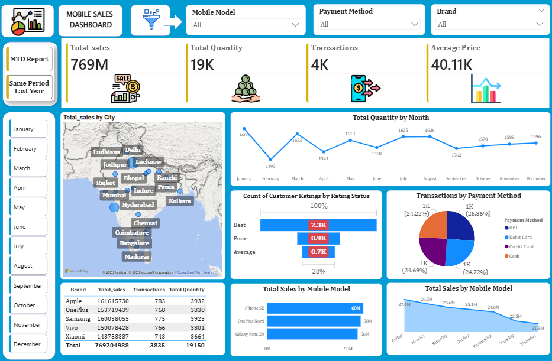

# 📊 Mobile Sales Performance Dashboard

## 📌 Brief One Line Summary
An interactive dashboard to analyze mobile sales performance, trends, and key business insights.

## 🔍 Overview
This project focuses on analyzing mobile sales data to understand business performance across different regions, brands, and time periods. The dashboard provides clear visualizations that help in tracking sales trends, customer behavior, and revenue generation.

## ❗ Problem Statement
Businesses often struggle to interpret large volumes of sales data and extract actionable insights. This project aims to simplify data analysis by providing a visual and interactive dashboard to monitor and improve sales performance.

## 📂 Dataset
- Sales data including product details, quantity, revenue, and date
- Region-wise and brand-wise sales information
- Customer purchase patterns

## 🛠️ Tools and Technologies
- Power BI / Tableau (for dashboard creation)
- Microsoft Excel / CSV (data source)
- Python (optional for data cleaning)
- SQL (for querying data)

## ⚙️ Methods
- Data Cleaning and Preprocessing
- Data Transformation
- Data Visualization
- KPI Analysis
- Trend Analysis

## 📈 Key Insights
- Identification of top-performing mobile brands
- Sales trends over time (monthly/yearly)
- Region-wise sales performance
- Best-selling products
- Revenue contribution by different segments

## 📸 Dashboard Preview

## 🖥️ Dashboard / Model / Output
The dashboard includes:
- Sales overview (total revenue, total sales, KPIs)
- Interactive filters (date, region, brand)
- Visual charts (bar charts, line graphs, pie charts)
- Performance comparison across categories

## ▶️ How to Run this Project?
1. Download the Power BI (.pbix) file from this repository  
2. Open it using Power BI Desktop  
3. Explore the dashboard using the interactive filters and visuals  

## ✅ Results & Conclusion
The dashboard helps in making data-driven decisions by providing clear insights into sales performance. It enables businesses to identify growth opportunities and improve overall strategy.

## 🔮 Future Work
- Integration with real-time data
- Advanced predictive analytics
- Deployment on web platforms
- Adding more detailed customer analytics

## 👤 Author & Contact
**Nikhil Soni**  
Aspiring AI/ML Engineer & Data Enthusiast  

- GitHub: https://github.com/your-username
- LinkedIn: https://linkedin.com/in/your-profile

---

⭐ If you found this project useful, consider giving it a star!
